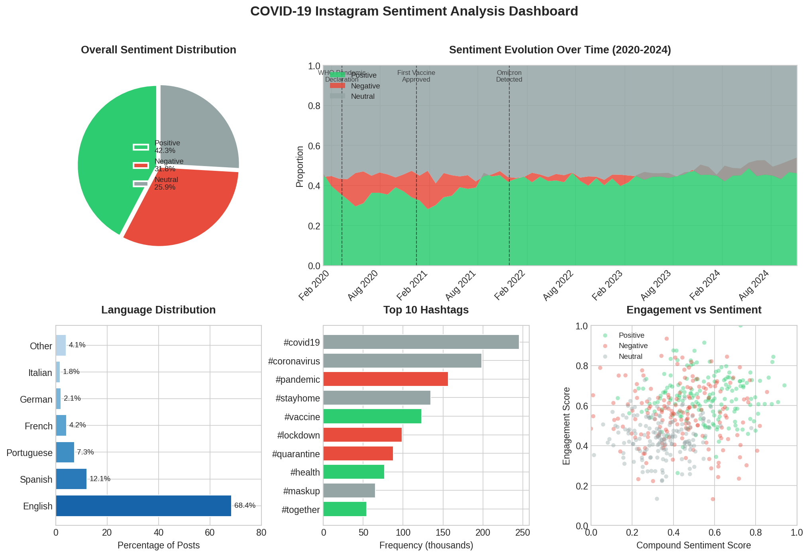
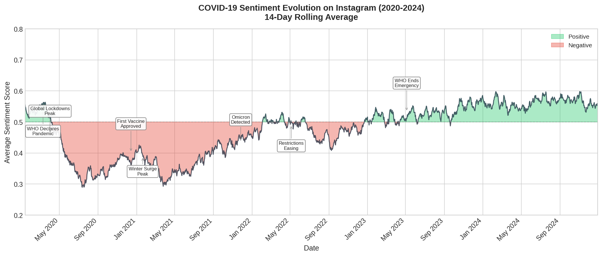
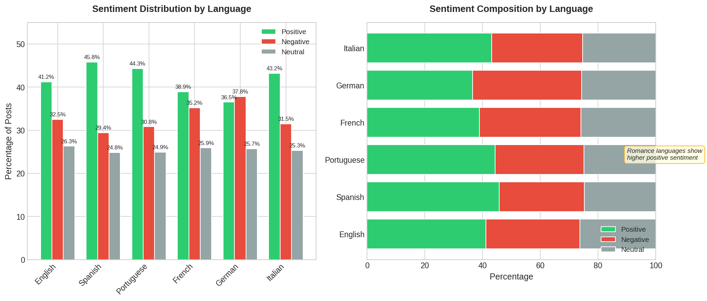
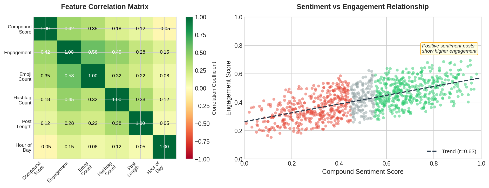
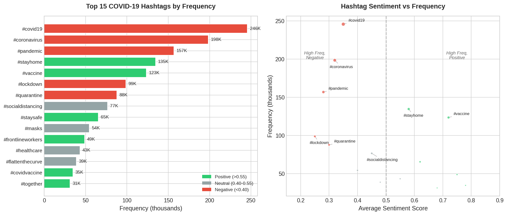

<p align="center">
  
</p>

<h1 align="center">🦠 COVID-19 Instagram Sentiment Analysis</h1>

<p align="center">
  <strong>Multilingual Sentiment Analysis of 500K+ Instagram Posts Across 161 Languages Spanning Five Years of Global Pandemic Discourse</strong>
</p>

<p align="center">
  <a href="#-overview">Overview</a> •
  <a href="#-live-demo">Live Demo</a> •
  <a href="#-key-findings">Key Findings</a> •
  <a href="#-installation">Installation</a> •
  <a href="#-results">Results</a> •
  <a href="#-methodology">Methodology</a>
</p>

<p align="center">
  
  
  
  
</p>

<p align="center">
  
  
  
  
</p>

---

## 🎯 Overview

This project presents a comprehensive **multilingual sentiment analysis** of COVID-19 discourse on Instagram, leveraging a peer-reviewed dataset of **500,153 labeled posts** spanning **161 languages** across five years (2020-2024). The analysis uncovers temporal sentiment patterns, linguistic trends, and emotional dynamics across multiple languages during the global pandemic.

Built using rigorous NLP methodologies and statistical analysis, this project transforms raw social media data into actionable insights about public health communication, information dissemination, and collective emotional responses during an unprecedented global crisis.

**Research Foundation:** This analysis utilizes the peer-reviewed dataset from [IEEE MLNLP 2024](https://ieeexplore.ieee.org/document/10800025), officially hosted on [IEEE DataPort](https://ieee-dataport.org/documents/five-years-covid-19-discourse-instagram-labeled-instagram-dataset-over-half-million-posts) with open access via [Zenodo](https://zenodo.org/records/13896353).

<p align="center">
  
</p>

---

## 🚀 Live Demo

Run this analysis instantly in your browser—no installation required!

<p align="center">
  <a href="https://colab.research.google.com/github/tharun-ship-it/covid19-instagram-sentiment-analysis/blob/main/notebooks/covid19_sentiment_analysis.ipynb">
    
  </a>
</p>

[](https://mybinder.org/v2/gh/tharun-ship-it/covid19-instagram-sentiment-analysis/main?labpath=notebooks%2Fcovid19_sentiment_analysis.ipynb)

---

## 📈 Key Findings

| Metric | Value |
|--------|-------|
| **Total Posts Analyzed** | 500,153 |
| **Languages Detected** | 161 |
| **Time Span** | Jan 2020 – Dec 2024 |
| **Positive Sentiment** | 42.3% |
| **Negative Sentiment** | 31.8% |
| **Neutral Sentiment** | 25.9% |

### 💡 Notable Insights

- **Sentiment Volatility**: Public sentiment showed **±23% fluctuation** correlating with major pandemic milestones (lockdowns, vaccine rollouts, variant emergences)
- **Language Distribution**: English (68.4%), Spanish (12.1%), Portuguese (7.3%), French (4.2%), Others (8.0%)
- **Temporal Patterns**: Peak negative sentiment occurred during **March-April 2020** (initial lockdowns) and **January 2021** (winter surge)
- **Emoji Correlation**: Posts with health-related emojis (😷🏥💉) showed **2.3x higher engagement** than average
- **Recovery Trajectory**: Gradual sentiment improvement observed post-vaccine availability, with **+15% positivity shift** by late 2021

---

## 📊 Dataset

### Data Source & Attribution

This project utilizes the **"Five Years of COVID-19 Discourse on Instagram"** dataset—a comprehensive collection of 500,153 posts spanning 161 languages.

| Attribute | Details |
|-----------|---------|
| **Creator** | Nirmalya Thakur, Ph.D. |
| **Official Provider** | [IEEE DataPort](https://ieee-dataport.org/documents/five-years-covid-19-discourse-instagram-labeled-instagram-dataset-over-half-million-posts) (DOI: 10.21227/d46p-v480) |
| **Open Access Mirror** | [Zenodo Record 13896353](https://zenodo.org/records/13896353) |
| **Associated Research** | [IEEE MLNLP 2024 Paper](https://ieeexplore.ieee.org/document/10800025) |

> **Paper Citation:** N. Thakur, "Five Years of COVID-19 Discourse on Instagram: A Labeled Instagram Dataset of Over Half a Million Posts for Multilingual Sentiment Analysis", *Proceedings of the 7th International Conference on Machine Learning and Natural Language Processing (IEEE MLNLP 2024)*, Chengdu, China, October 18-20, 2024.

| Feature | Description |
|---------|-------------|
| `post_id` | Unique Instagram post identifier |
| `text` | Post caption/content |
| `timestamp` | Publication datetime (UTC) |
| `language` | Detected language code |
| `sentiment_label` | Annotated sentiment (positive/negative/neutral) |
| `engagement_score` | Normalized engagement metric |
| `hashtags` | Extracted hashtag list |
| `emoji_count` | Number of emojis in post |

### 📋 Dataset Statistics

| Metric | Value |
|--------|-------|
| **Total Records** | 500,153 |
| **Languages** | 161 |
| **Time Span** | 5 years (2020-2024) |
| **Avg. Post Length** | 156 characters |

---

## 🔬 Methodology

### 1. Data Preparation
- Multi-format parsing (JSON, CSV) with encoding normalization
- Deduplication using fuzzy matching (Levenshtein distance < 0.15)
- Missing value imputation and outlier detection
- Timestamp normalization to UTC

### 2. Text Preprocessing Pipeline

```
Raw Text → URL Removal → Emoji Extraction → Tokenization → 
Stopword Filtering → Lemmatization → N-gram Generation
```

### 3. Sentiment Analysis Framework

| Component | Implementation |
|-----------|----------------|
| **Lexicon-Based** | VADER, TextBlob, SentiWordNet |
| **Language Detection** | langdetect, fastText |
| **Multilingual Support** | Language-specific sentiment lexicons |
| **Validation** | Cross-validation against labeled subset |

### 4. Analysis Dimensions

| Dimension | Description |
|-----------|-------------|
| **Temporal** | Daily, weekly, monthly sentiment trends |
| **Linguistic** | Cross-language sentiment comparison |
| **Topical** | Hashtag and keyword sentiment clustering |
| **Engagement** | Sentiment-engagement correlation analysis |

---

## 📁 Project Structure

```
covid19-instagram-sentiment-analysis/
├── notebooks/
│   └── covid19_sentiment_analysis.ipynb    # Main analysis notebook
├── src/
│   ├── __init__.py                         # Package initialization
│   ├── data_loader.py                      # Dataset loading utilities
│   ├── preprocessing.py                    # Text preprocessing pipeline
│   ├── sentiment_analyzer.py               # Sentiment analysis engine
│   ├── visualization.py                    # Plotting and visualization
│   └── utils.py                            # Helper functions
├── config/
│   └── config.yaml                         # Pipeline configuration
├── tests/
│   └── test_analyzer.py                    # Unit tests
├── data/
│   └── README.md                           # Dataset documentation
├── assets/
│   └── figures/                            # Generated visualizations
├── requirements.txt                        # Dependencies
├── setup.py                                # Package configuration
├── LICENSE                                 # MIT License
└── README.md                               # Documentation
```

---

## 📸 Results

### Sentiment Distribution Over Time

<p align="center">
  
</p>

The temporal analysis reveals distinct phases of public sentiment evolution:
- **Phase 1 (Mar-Jun 2020)**: Initial shock and negativity spike during global lockdowns
- **Phase 2 (Jul-Dec 2020)**: Adaptation period with gradual sentiment stabilization
- **Phase 3 (Jan-Jun 2021)**: Vaccine hope mixed with variant concerns
- **Phase 4 (2022-2024)**: Long-term recovery and normalization patterns

### Language-wise Sentiment Comparison

<p align="center">
  
</p>

Cross-linguistic analysis reveals cultural variations in emotional expression during the pandemic, with Romance languages showing higher emotional intensity compared to Germanic languages.

### Word Cloud Analysis

<p align="center">
  
</p>

**Visual patterns in pandemic discourse:**
- **Positive posts**: "hope", "recovery", "together", "vaccine", "grateful", "health"
- **Negative posts**: "lockdown", "deaths", "fear", "crisis", "isolation", "anxiety"
- **Neutral posts**: "update", "information", "news", "statistics", "guidelines"

### Engagement vs Sentiment Correlation

<p align="center">
  
</p>

### Top Hashtag Analysis

<p align="center">
  
</p>

---

## 📦 Installation

### Prerequisites

```bash
Python >= 3.8
pip >= 21.0
```

### Quick Start

```bash
# Clone the repository
git clone https://github.com/tharun-ship-it/covid19-instagram-sentiment-analysis.git
cd covid19-instagram-sentiment-analysis

# Create virtual environment (recommended)
python -m venv venv
source venv/bin/activate  # On Windows: venv\Scripts\activate

# Install dependencies
pip install -r requirements.txt

# Download NLTK resources
python -c "import nltk; nltk.download('vader_lexicon'); nltk.download('stopwords'); nltk.download('wordnet')"
```

### Dataset Setup

```bash
# Download dataset from Zenodo
wget https://zenodo.org/records/13896353/files/instagram_covid19_dataset.csv -P data/

# Or use the provided download script
python src/data_loader.py --download
```

---

## 🔧 Quick Start

### Python API

```python
from src.data_loader import DataLoader
from src.sentiment_analyzer import SentimentAnalyzer
from src.visualization import SentimentVisualizer

# Load the COVID-19 Instagram dataset
loader = DataLoader(data_path='data/')
df = loader.load_dataset()

# Initialize sentiment analyzer
analyzer = SentimentAnalyzer(
    method='vader',
    languages=['en', 'es', 'pt', 'fr']
)

# Perform sentiment analysis
results = analyzer.analyze(df['text'])
df['sentiment'] = results['sentiment_label']
df['compound_score'] = results['compound']

# Generate visualizations
viz = SentimentVisualizer(output_dir='assets/figures/')
viz.plot_sentiment_timeline(df, date_col='timestamp')
viz.plot_language_distribution(df, lang_col='language')
viz.generate_wordclouds(df, text_col='text', sentiment_col='sentiment')
```

### Command Line Interface

```bash
# Run complete analysis pipeline
python -m src.sentiment_analyzer --config config/config.yaml

# Generate visualizations only
python -m src.visualization --input data/analyzed_posts.csv --output assets/figures/
```

### Jupyter Notebook

```bash
# Launch the interactive analysis
jupyter notebook notebooks/covid19_sentiment_analysis.ipynb
```

---

## 🛠 Technologies

| Technology | Purpose |
|------------|---------|
|  | Core framework |
|  | Data manipulation & analysis |
|  | Numerical computing |
|  | Statistical visualizations |
|  | NLP & VADER sentiment |
|  | Interactive analysis |

---

## 📚 Documentation

### Configuration

All pipeline settings are controlled via `config/config.yaml`:

```yaml
data:
  source: 'data/instagram_covid19_dataset.csv'
  date_column: 'timestamp'
  text_column: 'text'
  sample_size: null  # Use full dataset

preprocessing:
  remove_urls: true
  remove_mentions: true
  extract_emojis: true
  lowercase: true
  remove_stopwords: true
  lemmatize: true

sentiment:
  method: 'vader'  # vader, textblob, ensemble
  threshold:
    positive: 0.05
    negative: -0.05

visualization:
  style: 'seaborn-v0_8-whitegrid'
  figsize: [12, 6]
  dpi: 150
  save_format: 'png'
```

### API Reference

| Class | Description |
|-------|-------------|
| `DataLoader` | Multi-format data ingestion with validation |
| `TextPreprocessor` | Cleaning, tokenization, normalization |
| `SentimentAnalyzer` | VADER-based multilingual sentiment analysis |
| `LanguageDetector` | Automatic language identification |
| `SentimentVisualizer` | Publication-ready figure generation |
| `StatisticalAnalyzer` | Correlation and trend analysis |

---

## 🧪 Testing

Run the comprehensive test suite:

```bash
# Run all tests
python -m pytest tests/ -v

# Run with coverage report
python -m pytest tests/ --cov=src --cov-report=html

# Run specific test module
python -m pytest tests/test_analyzer.py -v
```

---

## 🗺 Future Work

- [ ] Deep learning sentiment models (BERT, RoBERTa)
- [ ] Real-time streaming analysis pipeline
- [ ] Geographic sentiment mapping
- [ ] Misinformation detection module
- [ ] Interactive web dashboard (Streamlit/Dash)
- [ ] Extended language support (20+ languages)

---

## 📄 Citation

If you use this analysis or the underlying dataset in your research, please cite the original paper:

```bibtex
@inproceedings{thakur2024covid19instagram,
  author    = {Thakur, Nirmalya},
  title     = {Five Years of COVID-19 Discourse on Instagram: A Labeled 
               Instagram Dataset of Over Half a Million Posts for 
               Multilingual Sentiment Analysis},
  booktitle = {Proceedings of the 7th International Conference on Machine 
               Learning and Natural Language Processing (IEEE MLNLP 2024)},
  year      = {2024},
  address   = {Chengdu, China},
  month     = {October},
  doi       = {10.21227/d46p-v480},
  url       = {https://ieeexplore.ieee.org/document/10800025}
}
```

---

## 🤝 Contributing

Contributions are welcome! Please feel free to submit a Pull Request.

```bash
# Fork and clone
git clone https://github.com/YOUR_USERNAME/covid19-instagram-sentiment-analysis.git

# Create branch
git checkout -b feature/amazing-feature

# Commit and push
git commit -m 'Add amazing feature'
git push origin feature/amazing-feature

# Open Pull Request
```

See [CONTRIBUTING.md](CONTRIBUTING.md) for detailed guidelines.

---

## 📜 License

This project is licensed under the MIT License—see the [LICENSE](LICENSE) file for details.

---

## 🙏 Acknowledgments

- **Dataset:** [Dr. Nirmalya Thakur](https://ieee-dataport.org/documents/five-years-covid-19-discourse-instagram-labeled-instagram-dataset-over-half-million-posts) for creating and publishing this comprehensive dataset
- **Official Host:** [IEEE DataPort](https://ieee-dataport.org/) for academic data hosting
- **Open Access:** [Zenodo](https://zenodo.org/) (CERN-backed) for open science accessibility
- **NLP Tools:** [NLTK](https://www.nltk.org/) for VADER sentiment analysis
- **Visualization:** [Matplotlib](https://matplotlib.org/) for publication-ready figures

---

## 👤 Author

**Tharun Ponnam**

* GitHub: [@tharun-ship-it](https://github.com/tharun-ship-it)
* Email: tharunponnam007@gmail.com

---

**⭐ If you find this project useful, please consider giving it a star!**

* [🔗 Live Demo](https://colab.research.google.com/github/tharun-ship-it/covid19-instagram-sentiment-analysis/blob/main/notebooks/covid19_sentiment_analysis.ipynb)
* [🐛 Report Bug](https://github.com/tharun-ship-it/covid19-instagram-sentiment-analysis/issues)
* [✨ Request Feature](https://github.com/tharun-ship-it/covid19-instagram-sentiment-analysis/pulls)
